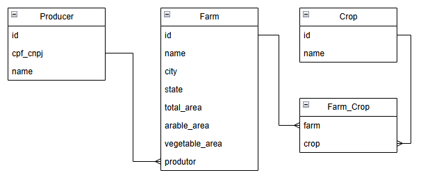

# 🚀 Brain Agriculture

## 📋 Descrição

Sistema simples manipulação de dados de produtores rurais.

### Modelagem do Banco de Dados

### Features:  
✔️ Rota para cadastrar produtores rurais    
✔️ Rota para excluir produtores rurais    
✔️ Rota para listar dados de um produtor rural    
✔️ Rota para listar dados para um dashboard

### Recursos técnicos:  
✔️ Documentação com OpenAPI (swagger) na rota /api-docs
✔️ Conteinerização com Docker  
✔️ Testes unitários com Jest  
✔️ Esteira de CI realizando testes automatizados
⚠️ Esteira de deploy automático para uma função lambda na AWS (implementado parcialmente, esteira funcionando)

### Melhorias futuras 
📌 Realizar migrations de forma automática ao rodar o docker  
📌 Deploy do banco de dados na nuvem  
📌 Aumentar coverage de testes unitários  
📌 Adicionar paginação

## 💻 Pré Requisitos

Para utilizar o projeto é necessário ter instalado em sua máquina:

- [Node >= 16.20.2](https://nodejs.org/en/download)
- [Docker >= 26.0.0](https://www.docker.com/products/docker-desktop/)

## 🛠️ Instalando e Rodando

1. Clone o sistema para seu ambiente com: `git clone https://github.com/JuliaDeNadai/brain-agriculture.git`

2. Em seu ambiente, entre na pasta do projeto `cd brain-agriculture`

3. Para utilizar a aplicação é necessário criar um arquivo `.env` com os dados de conexão com o banco de dados.
    > Utilize como modelo o arquivo `.env.example`

5. Inicialize a aplicação em ambiente de desenvolvimento através do comando 
    > docker-compose -f docker-compose.dev.yml up

5. Não foi possível realizar as migrations de forma automática, então será necessário rodar os comandos:
    > npm install -g db-migrate

    > npm install -g db-migrate-pg

    E por fim rodar as migrations manualmente com o comando:

    > npm run migrate

6. Pronto! O sistema estará rodando na porta 3000 e ficará disponível em:
    > http://localhost:3000/

### Decisões Técnicas

A arquitetura foi desenvolvida em camadas para manter a organização do código, além de ter bem definida a função de cada camada e funcões, seguindo o primeiro princípio do SOLID, Single Responsibility. Embora tenha diversas camadas, a arquitetura em si é simples, foi desenvolvida dessa forma pois esta aplicação não tende a escalar a longo prazo, o que torna a utilização de arquiteturas mais robustas um over engineering.

As endpoints foram desenvolvidas de forma a facilitar a utilização por parte do usuário, para criar um novo Produtor rural por exemplo, os dados referentes a fazenda e tipos de culturas é recebido como uma só entidade, mas ao entrar no sistema, o controller se encarrega de chamar cada repository separado para inserir os dados nas tabelas específicas.

As requisições ao banco foram realizadas por meio de uma classe implementada com o Design Pattern Singleton, afim de possuir somente uma instância do banco de dados para a aplicação, evitando conflitos de sessão.

A rota de dashboard foi desenvolvida de forma a diminuir o número de acessos ao banco de dados, dessa forma, alguns métodos do repository retornam diversos dados do banco para otimizar a utilização do mesmo, além de ser possível recuperar todos os dados necessários chamando uma única vez a API.

## 📜 Licença 

Este projeto não está sob nenhuma licença.
